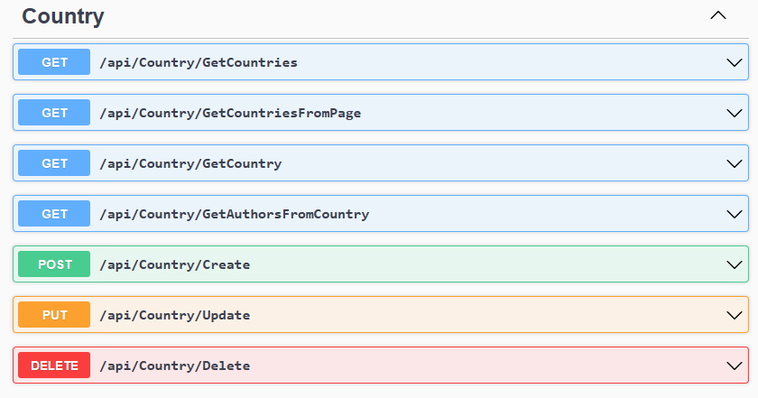
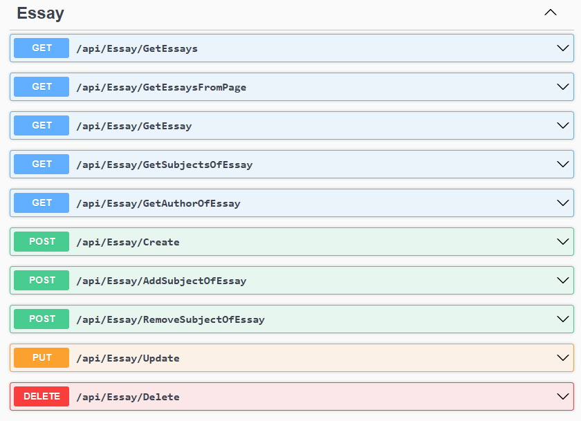
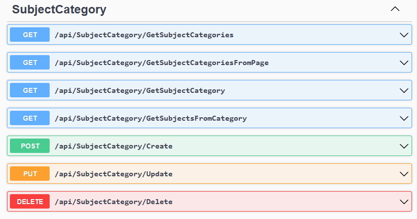
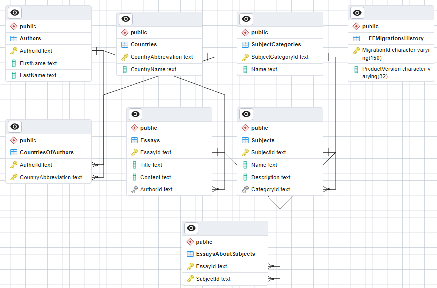

# Essays.WebApi
Web-API project for creating and managing essays about arbitrary subjects. 

This project was created in educational purposes only.
## Demonstration
### A brief APIs showcase:

### Entity relationship diagram (ERD):

